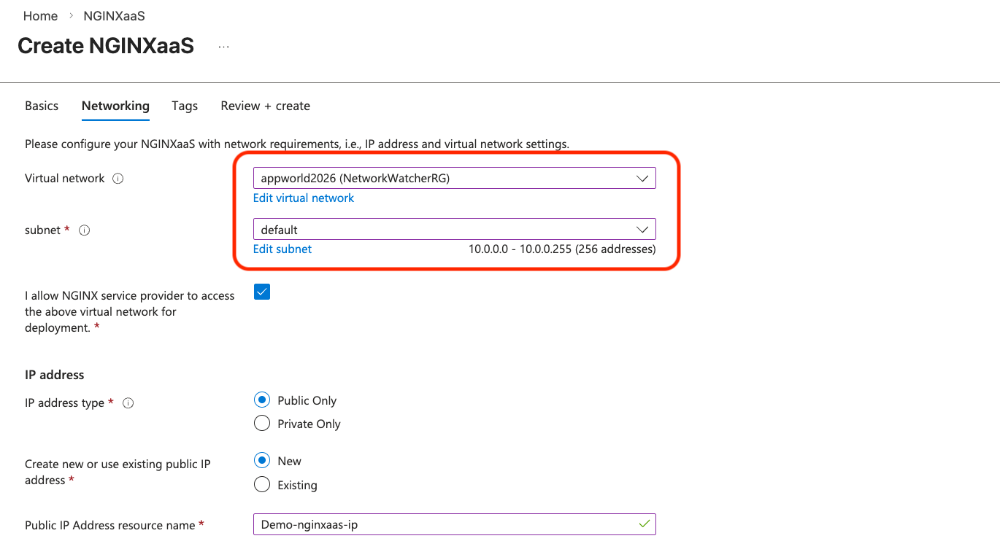
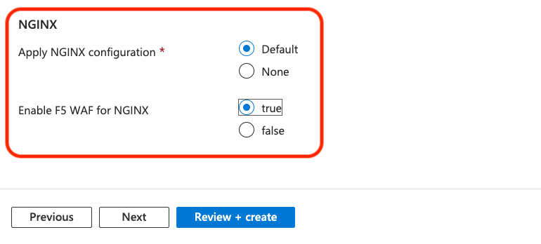
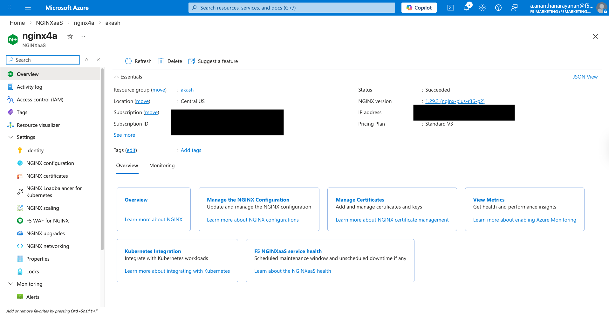

# Lab 1: Deploying and Exploring NGINX for Azure

## Overview
Welcome to **AppWorld 2026**. This lab is a core component of the session:  
**"Mastering cloud-native app delivery: Unlocking advanced capabilities and use cases with F5’s ADCaaS."**

In this module, you will transition from infrastructure prep to active service delivery. You will deploy your NGINX for Azure (NGINXaaS) resource, establish an observability pipeline, and verify your deployment with an initial configuration.

---

## 🏗️ Pre-provisioned Infrastructure
To maximize our time during this workshop, the following baseline infrastructure has already been provisioned for you:

* **Azure Resource Group:** A dedicated container for all workshop resources.
* **Virtual Network & Subnets:** A VNet including a delegated subnet specifically for NGINX for Azure.
* **Network Security Group (NSG):** Pre-configured rules for inbound traffic (Port 80/443).
* **Managed Identity:** A user-assigned identity for secure, secret-less access to Azure services.
* **Azure VM Running the Cafe and Juice Shop Applications:** "Upstream" backend applications to be proxied by NGINX for Azure.

## Prerequisites

- You must have an Azure login.
- Familiarity with basic Linux concepts and commands.
- Familiarity with basic Azure concepts and commands.
- Familiarity with basic NGINX concepts and commands.
- The lab instructor will assign you a student number. Use this in place of "\<student-number\>" for this lab.

<br/>


<br/>

---

## 🚀 Lab Exercises

### Task 1: Access Your Azure Account
When you initially access the Azure portal, you will need to sign in and authenticate though an authenticator app. Begin by going to https://portal.azure.com/signin/index/@f5nginxpert.onmicrosoft.com from your desktop browser. If you have an existing Azure account, we recommend opening this link in an incognito window in order to avoid conflicts.

- User name: `<student-number>.student@f5nginxpert.onmicrosoft.com` (Use your assigned student number in place of `<student-number>`.)
- Password: This will be provided by your lab instructors.

### Task 2: Deploy an NGINX for Azure Resource
Now, you will deploy the NGINX for Azure resource and bind it to the pre-provisioned network and identity.

1.  In the Azure Portal, search for and select **NGINXaaS**.
2.  Click **Create**.
3.  **Basics Tab:**
    * **Resource Group:** Select the specific Resource Group assigned to you for this workshop. For AppWorld 2026, this will be `Student<student-number>` (i.e., _StudentNinety-nine_).
    * **Instance details >> Name:** Give your deployment a unique name (e.g., `<student-number>-nginx-deployment-lab1`).
    * **Region:** Select the region specified by your instructor. For AppWorld 2026, this will be `Central US`.
    * **Pricing Plan:** Select the **Standard V3** SKU.
    * **Terms** You will need to accept the terms to continue.
    * **NCU Capacity:** Enter 10 for the NGINX Capacity Unit (NCU) unless directed otherwise.
    * Click `Next`.
4.  **Networking Tab:**
    * **Virtual Network:** Select the VNet assigned to your resource group. For AppWorld 2026, this will be **appworld2026**.
    * **Subnet:** Select the `default` subnet unless otherwise instructed.
    * **Access Consent:** Click the checkbox for **"I allow NGINX service provider to access the above virtual network for deployment."**
    * **Public IP:** Create a new Public IP address.
    * **Apply NGINX configuration:** Select "Default".
    * **Enable F5 WAF for NGINX:** Select "true".
    * Click `Next`.
   

   
      
5.  **Review + Create:**
    * Click **Review + Create**. Once validation passes, click **Create** to launch your NGINX instance.
  
### Task 3: Create Log Analytics Workspace & Enable Monitoring
Before exploring the resource, we will set up the logging destination to ensure all subsequent activity is captured.

1.  In the Azure Portal, search for and select **Log Analytics workspaces**.
2.  Click **Create**, select your **Resource Group**, and name it (e.g., `<student-number>-nginx-workshop-logs`). Make a note of this workspace name as you will need to reference it again later.

  
  
3.  Once created, navigate back to your **NGINX for Azure resource** `<student-number>-nginx-deployment-lab1`.
4.  Under the **Monitoring** section, select **Diagnostic settings**.

 
    
5.  Select **+ Add diagnostic setting**. Give it a name (e.g., `<student-number>-diagnostic>`).
6.  Under the **Logs Categories** section check both **NGINX Logs** and **NGINX Security Logs**.
7.  Under **Destination details**" check **Send to Log Analytics workspace** and select the workspace you just created.
8.  **Save** the settings.

  

### Task 4: Explore Nginx for Azure

NGINX as a Service for Azure is a service offering that is tightly integrated into Microsoft Azure public cloud and its ecosystem, making applications fast, efficient, and reliable with full lifecycle management of advanced NGINX traffic services. NGINXaaS for Azure is available in the Azure Marketplace.

NGINXaaS for Azure is powered by NGINX Plus, which extends NGINX Open Source with advanced functionality and provides customers with a complete application delivery solution. Initial use cases covered by NGINXaaS include L4 TCP and L7 HTTP load balancing and reverse proxy which can be managed through various Azure management tools. NGINXaaS allows you to provision distinct deployments as per your business or technical requirements.

In this section you will be looking at NGINX for Azure resource that you created within Azure portal.

1. Open Azure portal within your browser and then open your resource group.

   

2. Click on your NGINX for Azure resource (`<student-number>-nginx-deployment-lab1`) which should open the **Overview** section of your resource. You can see useful information like Status, NGINX for Azure resource's public IP, which NGINX version is running, which VNet/Subnet it is using, etc.

   

3. Navigate back to **Overview** section and copy the public IP address of NGINX for Azure resource. Also, take note of this IP address, as you will need it in later labs.

   

4. Open your RDP session to the jump host and open Chrome.

6. In the Chrome browser, paste the public IP into the address bar. You will notice the sample index page gets rendered into your browser.

   

   If this does not load, you can try the following troubleshooting steps:
   - Verify a network security group is in place and allows your client to reach your NGINXaaS instance on port 80.
   - From a command line, run "curl http://\<public-IP-address\> -vv".
   - Ask a lab instructor for additional help.

7. Congratulations!!! you have successfully deployed the sample index page within NGINX for Azure. This also completes the validation of all the resources that you created using Azure CLI. In the upcoming labs you would be modifying the configuration files and exploring various features of NGINX for Azure resources.

   **Set your IP variable** (Replace with your actual NGINXaaS Public IP):

   ```bash
   export MY_N4A_IP="YOUR_NGINX_PUBLIC_IP"
   ```
   
<br/>

**This completes Lab1.**

[Continue to Lab2](../lab2/readme.md)


